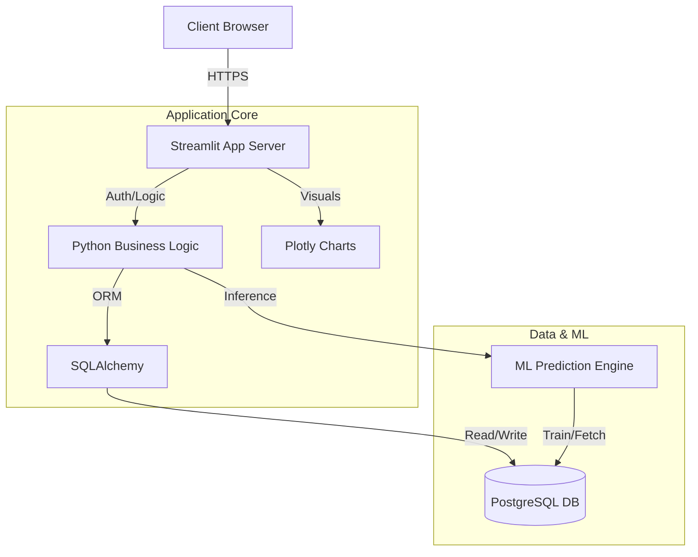
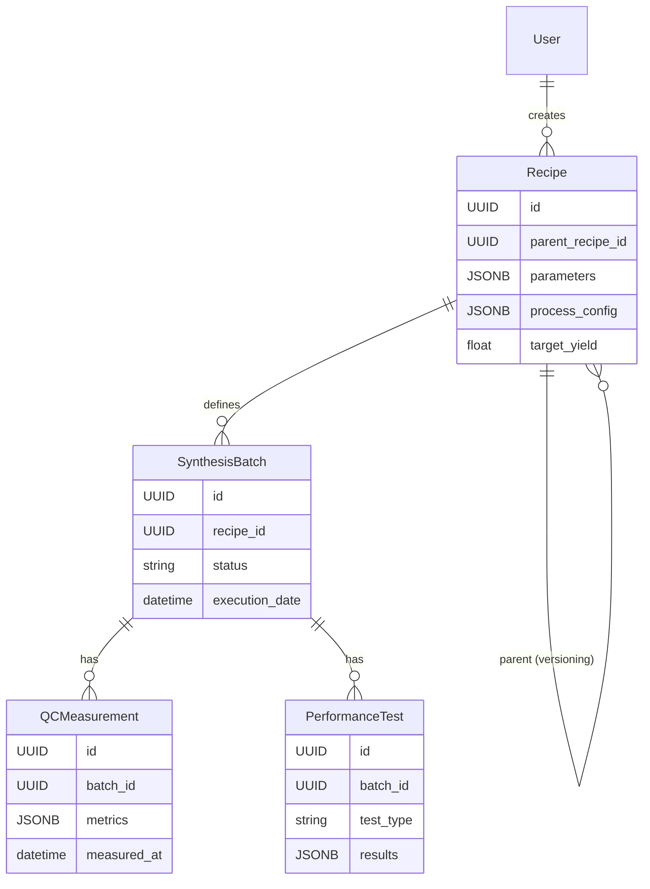

# Nanogence C-S-H R&D Platform - Technical Design Specification

# Nanogence C-S-H R&D Platform - Technical Design Specification

## 1. System Architecture Overview
To prioritize simplicity and ease of data entry while maintaining powerful data capabilities, the platform will be built as a monolithic **Streamlit** application. This allows for rapid development of interactive data forms and dashboards using only Python.

### Technology Stack Recommendation
*   **Application Framework**: **Streamlit** (Python).
    *   *Rationale*: "Low-code" experience for data scientists. Allows building complex forms, sidebars, and interactive charts with simple Python scripts. No HTML/CSS/JS knowledge required.
*   **Database**: **PostgreSQL** (via **SQLAlchemy**).
    *   *Rationale*: We still need a robust database to handle the relational complexity of Recipe Lineage and strict typing of scientific data, rather than a spreadsheet.
*   **Visualization**: **Plotly** (native integration with Streamlit).
*   **ML Engine**: **Scikit-Learn / XGBoost** embedded directly in the app or as a background thread.
*   **Deployment**: a single **Docker** container.

### High-Level Modules (Streamlit Pages)
1.  **Home/Dashboard**: High-level metrics and navigation.
2.  **Recipe Designer**: Form to create/clone recipes.
3.  **Lab Notebook**: View for operators to execute batches and enter QC data.
4.  **Analytics Explorer**: Flexible plotting tool.

---

## 2. Data Schema Design
The data model uses a hybrid approach: strict relational structure for core linkages and JSONB for flexible experimental parameters.

---

## 2. Data Schema Design
The data model uses a hybrid approach: strict relational structure for core linkages and JSONB for flexible experimental parameters.

### Core Entities (ERD Concepts)

#### `User` / `Role`
*   Standard RBAC (Admin, Researcher, Viewer).

#### `Recipe` (The "Plan")
*   `id`: UUID
*   `parent_recipe_id`: UUID (Self-reference for lineage/cloning)
*   `version`: Integer
*   `parameters`: JSONB
    *   `ca_si_ratio`: Float
    *   `molarity_ca_no3`: Float
    *   `total_solid_content`: Float
    *   `pce_content_wt`: Float
*   `process_config`: JSONB
    *   `feeding_sequence`: List[Step] (Ordered)
    *   `rate_of_addition`: Float
*   `created_by`: User UUID
*   `created_at`: Datetime

#### `SynthesisBatch` (The "Execution")
*   `id`: UUID
*   `recipe_id`: FK to Recipe
*   `lab_notebook_ref`: String (External ID)
*   `execution_date`: Datetime
*   `operator`: User UUID
*   `status`: Enum (Planned, In-Progress, Completed, Failed)

#### `QCMeasurement` (The "Quality Check")
*   `id`: UUID
*   `batch_id`: FK to SynthesisBatch
*   `measured_at`: Datetime
*   `data`: JSONB
    *   `particle_size_d10`: Float
    *   `particle_size_d50`: Float
    *   `particle_size_d90`: Float
    *   `ph`: Float
    *   `solid_content_measured`: Float
    *   `custom_metrics`: map<string, value>

#### `PerformanceTest` (The "Result")
*   `id`: UUID
*   `batch_id`: FK to SynthesisBatch
*   `test_type`: Enum (Mortar, CementPaste)
*   `mix_design_id`: FK to MixDesign (Separate entity for mix constants)
*   `cast_date`: Datetime
*   `results`: JSONB
    *   `fresh_density`: Float
    *   `flow`: Float
    *   `heat_of_hydration_curve`: Array<Point> (or reference to blob storage)
    *   `compressive_strength`: Array<{age: int, value: float, unit: string}>

---

## 3. UI/UX Flow Description

### A. Recipe Generator (The "Design" Phase)
1.  **Dashboard Entry**: "New Experiment" button.
2.  **Base Selection**: Option to "Start from Scratch" or "Clone Existing Recipe".
3.  **Parameter Input**:
    *   Three-column layout:
        *   **Col 1**: Chemical Composition (Sliders + Number Inputs for Ca/Si, etc.).
        *   **Col 2**: Process Parameters (Dynamic list for feeding sequence).
        *   **Col 3**: Live Preview (Calculated theoretical yield or warnings).
4.  **Save/Version**: User clicks "Save". System asks if this is a minor tweak (new version) or new branch (new recipe).

### B. Lab Mode (The "Execution" Phase)
*   *Tablet-optimized view.*
1.  **Batch context**: Operator selects a Recipe -> clicks "Start Synthesis".
2.  **Process Checklist**: System displays the feeding sequence as interactive checkboxes.
3.  **QC Quick-Add**: Modal pops up for "Post-Synthesis QC". Fields for pH and D50 are prominent.

### C. Performance Data Entry
1.  **Batch Search**: Find the synthesis batch (e.g., by date or ID).
2.  **Test Association**: Click "Add Performance Test".
3.  **Matrix Input**: A spreadsheet-like grid for entering Compressive Strength at 1d, 3d, 7d, 28d.
    *   *Auto-save* implementation to prevent data loss.

---

## 4. Dashboard & Visualization Concepts

### "The Correlation Explorer"
*   **X-Axis Selector**: Dropdown to choose any Input (Recipe Parameter) or QC Metric.
*   **Y-Axis Selector**: Dropdown to choose Performance Metric (e.g., 28d Strength).
*   **Filters**: Sidebar to filter by "Ca/Si Ratio range" or "PCE type".
*   **The Chart**: Interactive Scatter Plot. Hovering over a dot shows the exact Batch ID and quick summary. Clicking navigates to the Batch Detail page.

### "Heatmap Matrix"
*   A grid showing correlation coefficients (Pearson/Spearman) between all numeric variables to identify hidden drivers of performance.

### "lineage Tree"
*   A visual node-graph showing how Recipe A evolved into Recipe B and C, color-coded by performance (Green = High Strength, Red = Low).

---

## 5. Predictive Modeling & Analytics

### Approach
We will treat this as a **Supervised Regression Problem**.

*   **Inputs (X)**:
    *   Recipe Params (Ca/Si, Molarity, etc.)
    *   Process Params (Rate, Sequence - encoded as ordinal or one-hot)
    *   QC Params (D50, pH - *Optional, for "Post-QC" prediction*)
*   **Target (Y)**: Compressive Strength (at specific age, e.g., 28d).

### Pipeline
1.  **ETL**: Nightly job flattens the relational DB into a wide format CSV/Parquet.
2.  **Feature Engineering**:
    *   *Interaction terms*: e.g., `Ca_Si_Ratio * Molarity`.
    *   *Imputation*: Handling missing QC data (using defaults or mean).
3.  **Model Training**:
    *   Primary Candidate: **XGBoost** or **RandomForest** (Handles non-linearities and interactions well, interpretable via SHAP).
    *   Baseline: Linear Regression (for sanity check).
4.  **Evaluation**: RMSE (Root Mean Squared Error) on a hold-out test set. 5-Fold Cross Validation.

### User Features
*   **"What-If" Simulator**: Users adjust sliders (Recipes) and see a real-time predicted Strength gauge with a confidence interval (using Quantile Regression or Conformal Prediction).

---

## 6. Scalable Implementation Suggestions
1.  **Day 1 - Modular Codebase**: Establish a "Shared Library" for domain logic (e.g., calculating theoretical yield) that is used by both the Backend API and the ML Worker.
2.  **API-First Design**: Ensure the UI is just a consumer of the API. This allows future Python scripts to interact directly with the platform for bulk-uploads or automated analysis.
3.  **Flexible Schema**: Use JSONB heavily for the "Measurements" parts. Scientific instrumentation changes often; you don't want to run DB migrations every time a new sensor is added.
4.  **Audit Trail**: Implement "Soft Deletes" and history tables. R&D data is IP; never actually delete rows from the DB, just mark `is_active=False`.
